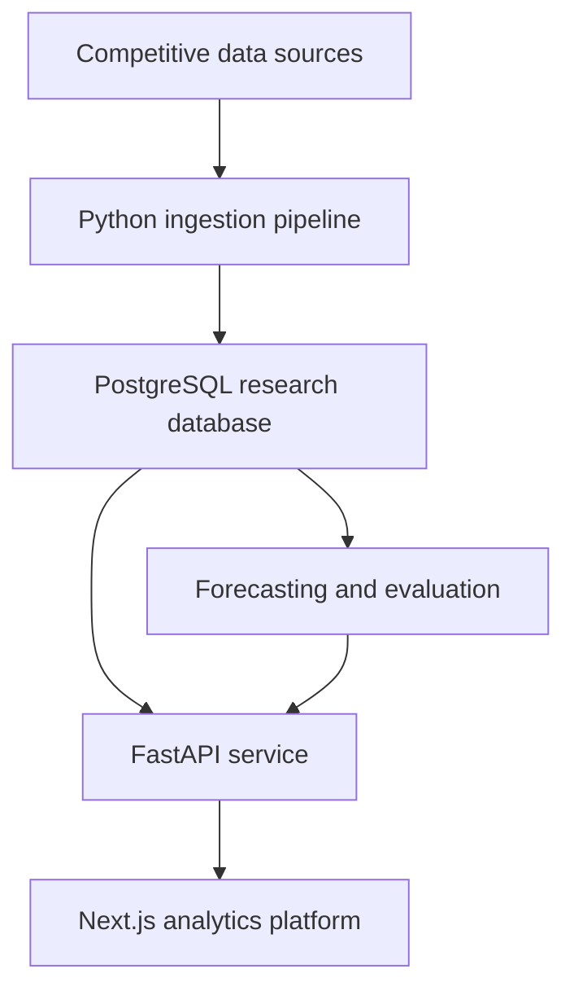

# ClutchQuant

ClutchQuant is an esports-native quantitative research platform for Valorant. It transforms competitive match data into structured datasets, matchup analysis, probabilistic forecasts, and long-term measurements of forecasting accuracy.

Most esports statistics platforms explain what already happened. ClutchQuant is built around a harder question: **what could have been predicted before the match began?**

## Core research question

Can competitive gaming expertise and historical match data produce reliable, well-calibrated forecasts?

ClutchQuant evaluates that question by recording human and model predictions before matches, preserving the information available at prediction time, and comparing those forecasts against actual results.

## Core capabilities

- Ingest match, map, team, player, roster, event, and performance data
- Resolve inconsistent team and player identities across historical records
- Build matchup-level features from recent form, map pools, roster changes, and opponent strength
- Generate model-based win probabilities
- Record human forecasts alongside model forecasts
- Lock predictions before match time to prevent hindsight bias
- Measure calibration, accuracy, Brier score, log loss, and performance over time
- Compare internal probabilities against external market probabilities
- Explore teams, players, maps, events, and historical matchups through an interactive dashboard
- Preserve raw data and dataset versions for reproducible research

## Forecasting workflow

1. Competitive data is collected from public Valorant sources.
2. Raw records are cleaned, validated, and converted into normalized entities.
3. Historical features are calculated using only information available before each match.
4. Human and model forecasts are recorded with timestamps.
5. Predictions become immutable when the match begins.
6. Results are ingested and forecasts are evaluated.
7. Calibration and performance are tracked across teams, events, regions, and model versions.

## System architecture

## Technology

- **Frontend:** Next.js, React, and TypeScript
- **Backend:** Python and FastAPI
- **Database:** PostgreSQL
- **Data layer:** SQLAlchemy and Alembic
- **Infrastructure:** Docker
- **Data collection:** Python-based ingestion and parsing pipelines
- **Research:** Statistical modeling, probability calibration, and reproducible evaluation

## Repository structure

- `apps/web` contains the Next.js analytics interface.
- `apps/api` contains the FastAPI application, database models, migrations, ingestion pipelines, and research logic.
- PostgreSQL stores normalized competitive data, forecasts, model outputs, and evaluation results.

## Research principles

### No hindsight

Every forecast is timestamped and evaluated using only information that existed before the match.

### Calibration over confidence

A useful forecasting system should not simply pick winners. Predictions assigned a 70% probability should succeed approximately 70% of the time.

### Reproducibility

Raw inputs, transformations, feature definitions, and model versions are preserved so results can be recreated and audited.

### Domain knowledge as data

Competitive expertise is treated as something measurable. Human forecasts can be compared directly with statistical models to determine where experience adds predictive value.

## Why ClutchQuant

ClutchQuant combines full-stack engineering, data infrastructure, statistical research, and firsthand high-level Valorant experience. The project is informed by experience reaching the Top 25 of the North American ranked leaderboard and contributing to two LAN championship runs.

The goal is not to create another match-picks page. It is to build a serious research platform for understanding uncertainty, testing competitive intuition, and measuring whether esports expertise can produce a repeatable forecasting advantage.